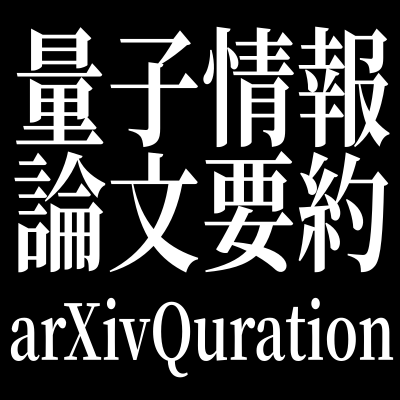

# arXivQuration
repository to share the quantum information & quantum computer articles

- [投稿する](https://github.com/arXivQuration/arXivQuration/issues/new?assignees=&labels=&template=Article-Template.md&title=)
- [要約一覧を見る](https://github.com/arXivQuration/arXivQuration/issues)

# arXivQurationについて

[arXivTimes](https://github.com/arXivTimes/arXivTimes)さんの量子情報・量子コンピュータ版を作りたくて、コンセプトを勝手にパクりました。
量子情報や量子コンピュータに関するarXivの要約をIssuesにまとめていく感じです。

# How to contribute

参加者大募集です。管理人自身そんなに量子情報に詳しくなく、大量に論文読んでるわけでもないので、一人じゃやっていけません。ぜひ手伝って下さい。

論文のまとめを投稿する際は、以下の要領でお願いいたします。

* 登録したい論文は、Issueに登録を行ってください。
* Issueのタイトルを論文とし、内容はIssue Templateに従ってください。登録時必須なのは以下点のみです
  * 一言でいうと
  * 論文リンク
  * 著者/所属機関 ※論文からのコピペでOK
  * 投稿日付 Submission dateです。yyyy/MM/ddの形式でお願いします。学会に提出されている場合は、それについても記載いただけると助かります(NIPS 2017など)
* 「一言でいうと」の分量は、Twitterで呟ける程度が目安です。問題設定・アプローチ手法・結果が端的にまとまっているのがよい「一言」です。未読の人になるべくその内容が伝わるよう、工夫を凝らしてください。
* Issueのより詳細な内容について記載を行う場合は、担当者に(Assignees)自分を設定してください。これは読んでいる論文のバッティングを防ぐための措置です
* 論文の内容に応じて、Labelをつけてください(現時点ではContributorのみ付与可能なので、投稿頂いた場合こちらで付与を行わせていただきます)
* コメントには、論文を読んでの所感や評価、また理解が難しい点などがあったらその旨を記載してください
* 論文が学会に採択された場合、投稿した論文のコメントにてご連絡ください。

# 著作権
Issueのテンプレートおよび、ReadmeのHow to contributeは、arXivTimes様のものを流用しています。(MITライセンス)
